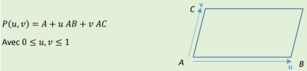
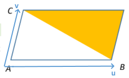

# 3DRealiste
[E4FI Projet] : Moteur de rendu 3D photoréaliste 

#### MISE EN PLACE DU PROJET

##### Nommage des variables

Il a été décidé de nommer toutes nos variables en **français** pour garder une certaine harmonie avec le code projet déjà fourni. 


#### PRISE EN MAIN

##### Modélisation d'un triangle dans l'espace

On sait déjà que pour modéliser un parallélogramme, on utilise la fonction suivante en utilisant u comme axe des abscisses et v en axe des ordonnées :




Pour modéliser un triangle dans l'espace, (prisme triangulaire), on utilise la même chose en rajoutant simplement la condition **u+v >=1** : 



On obtient donc le code suivant, avec un simple rajout de la condition if(u+v>=1) par rapport au rendu du parallélogramme: 

`


```c#
//////////////////////////////////////////////////////////////////////////
///
///     Triangle 3D
/// 
//////////////////////////////////////////////////////////////////////////
V3 Origine = new V3(500, 200, 300);
V3 Coté1 = new V3(300, 000, 000);
V3 Coté2 = new V3(000, 200, 000);
Couleur CRect = Couleur.Blue;

pas = 0.02f;
for (float u = 0; u < 1; u += pas)  // echantillonage fnt paramétrique
    for (float v = 0; v < 1; v += pas)
    {
        if (u+v >=1) 
        {
        V3 P3D = Origine + u * Coté1 + v * Coté2;

        // projection orthographique => repère écran

        int x_ecran = (int)(P3D.x);
        int y_ecran = (int)(P3D.y);
        BitmapEcran.DrawPixel(x_ecran, y_ecran, CRect);
    	}
	}`
```
